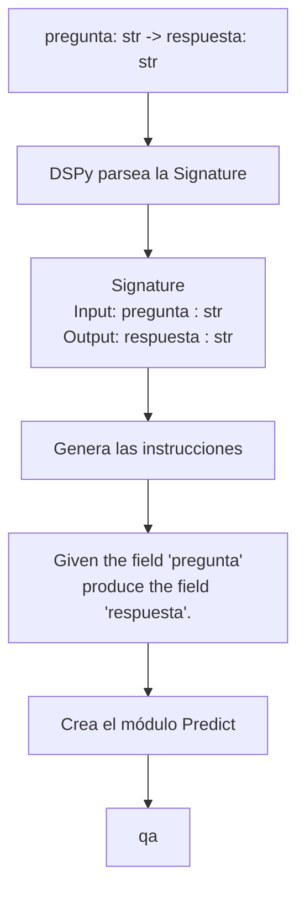

# Flujo Signature → Predict

```mermaid
flowchart TD

A["pregunta: str -> respuesta: str"]
    --> B["DSPy parsea la Signature"]

B --> C["Signature<br/>Input: pregunta : str<br/>Output: respuesta : str"]

C --> D["Genera las instrucciones"]

D --> E["Given the field 'pregunta'<br/>produce the field 'respuesta'."]

E --> F["Crea el módulo Predict"]

F --> G["qa"]
```
